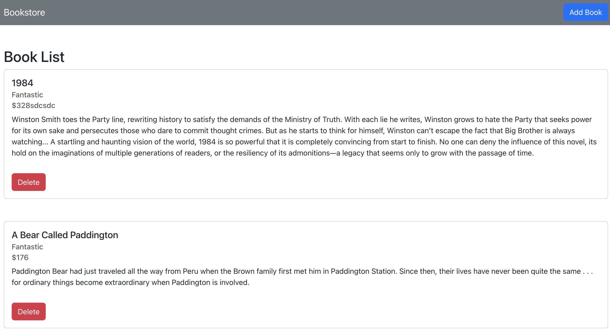
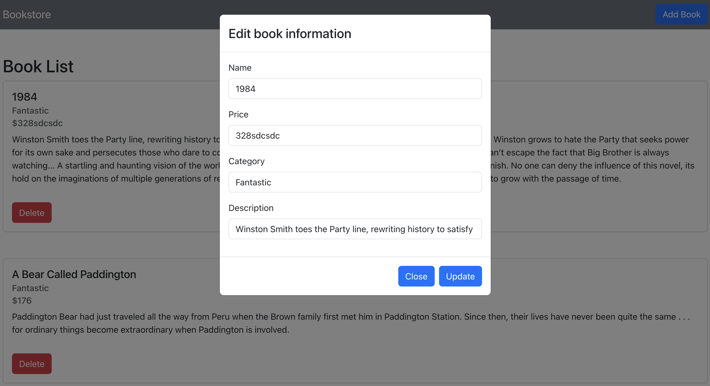
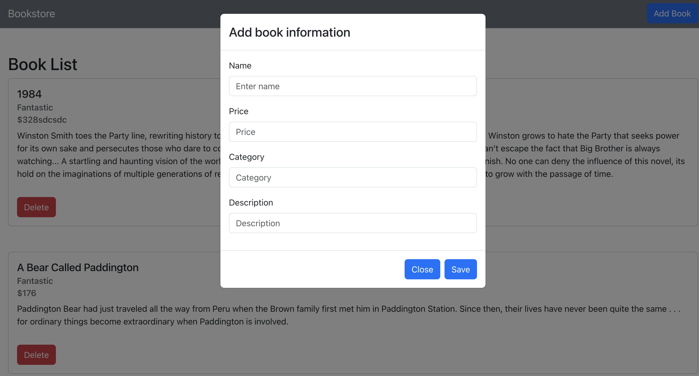

# Bookstore

> Web application that allows users to browse books, and add, update, and delete.






## Features

I built a web application with helping Javascript/React/Redux and React Bootstrap library that allows users to browse books, and add, update, and delete.
1. It's a single-page application with book details, the main page has a book list that shows the book name, price, and category and a delete button at the end for each book. There is an add button at the top so the user can add a book.
2. The user can click the add a book button, and it pops up a page, where the user can add a book ( name, price, category, and description ).
3. The book is clickable, if the user clicks the book, it will show a popup page, and the user can be able to modify the book name, price, category, and description. After modification: the book details can be updated on the main page.
4. When the user clicks the delete button, the book can be deleted from the main page.

### Review

Open [https://bookstore-test.netlify.app/](https://bookstore-test.netlify.app/) to view it in the browser.


### Install Dependencies

```
npm install
```

### Run

```

# Run frontend
npm run start
```


